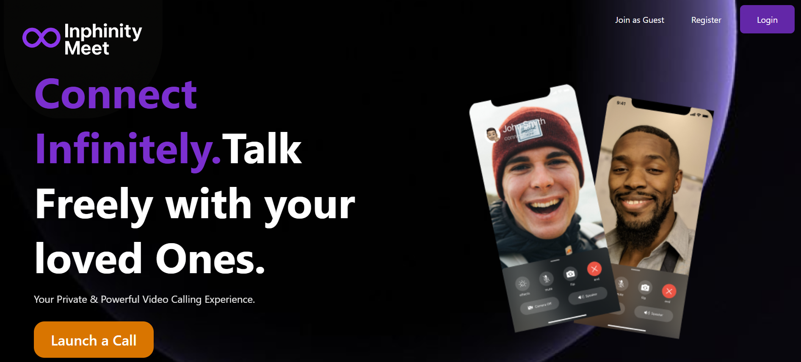

# Inphinity Meet

**Inphinity Meet** is a private and powerful video calling web application designed to help you **connect infinitely** and **talk freely** with your loved ones. Built with modern web technologies, it offers seamless, secure, and high-quality video conferencing experiences from your browser.

---

## 🌟 Features

* **One‑click launch**: Instantly start or join a call without complicated setup.
* **Guest access**: Share a link for friends or family to join as guests—no signup required.
* **User accounts**: Register and log in to secure your calls and access advanced features.
* **Responsive UI**: Works beautifully on desktop and mobile devices.
* **Customizable Favicon**: Distinctive infinity‑symbol icon for easy tab identification.
* **End‑to‑End Encryption**: Keeps your conversations private and secure.
* **Mute/Unmute & Camera Toggle**: Control your audio and video streams with simple buttons.
* **Dark & Light Themes**: Choose the look that fits your style.

---

## 🚀 Getting Started

### Installation

1. **Clone the repository**

2. **Install dependencies on both Frontend and Backend**

   ```bash
   npm install
   ```

3. **Start the development server**

   ```bash
   npm run dev  [Backend]
   npm start    [Frontend]
   ```

4. **Open in browser**
   Navigate to `http://localhost:3000` to see the app live.

---

## **Screenshots**


---

## 💡 Usage

* Click **"Launch a Call"** to start a new meeting.
* Share the URL with participants to let them join as guests.
* Toggle your camera and microphone using on-screen controls.

---

## 📬 Contact

* **Author**: Priyanshu Chaudhary ([priyanshukaushal14@gmail.com](mailto:priyanshukaushal14@gmail.com))

Happy calling! ✨
